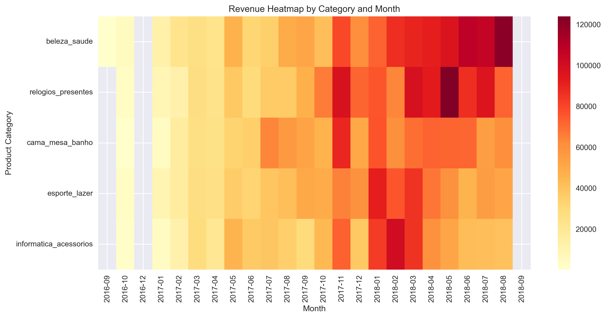
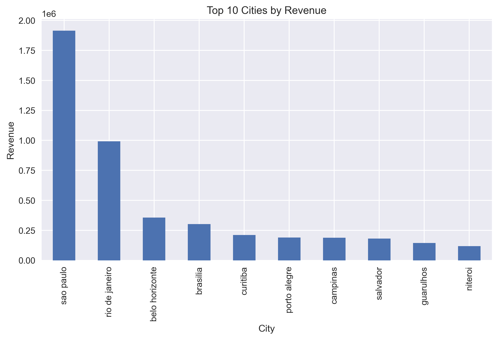
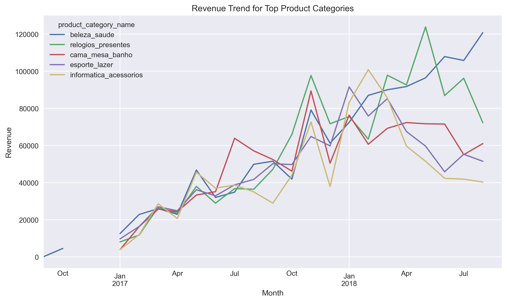
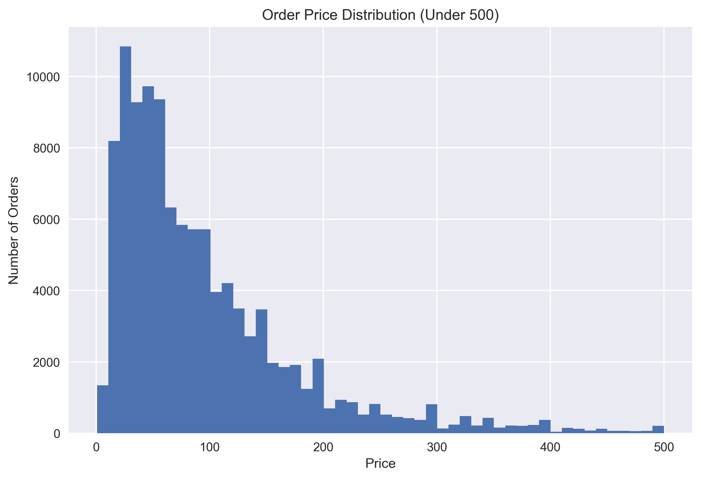
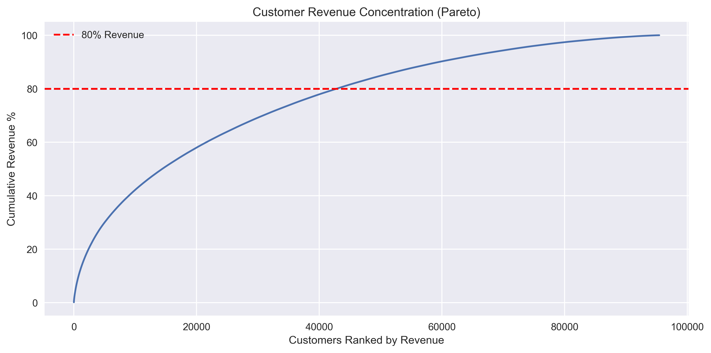

# Brazilian E-Commerce Sales Analysis

This project explores transactional data from a Brazilian e-commerce platform to identify key revenue drivers, customer behaviour patterns, and strategic business insights.

The analysis focuses on understanding which products, locations and pricing strategies contribute most to overall sales performance.

The goal is to demonstrate how data analysis can be used to generate actionable insights for an online retail business.

## Example Visualisation



## Additional Visualisations

### Top 10 Cities by Revenue



### Monthly Revenue Trend



### Order Price Distribution



### Customer Revenue Concentration



## Dataset

The dataset contains **112,650 transactions** from a Brazilian e-commerce platform.

### Key variables used in the analysis include:

| Variable | Description |
|----------|-------------|
| `order_date` | Date of purchase |
| `price` | Order item price |
| `product_category_name` | Product category |
| `customer_city` | Customer location |
| `customer_id` | Unique customer identifier |

The dataset includes approximately:

- **96,000 unique customers**
- **4,000+ cities**
- **Multiple product categories**

## Tools Used

- **SQL** - data extraction and table joins  
- **Python (Pandas)** - data cleaning and analysis  
- **Matplotlib / Seaborn** - data visualisation  
- **Jupyter Notebook** - analysis environment  

## Key Questions

This analysis investigates several business questions:

- Which product categories generate the most revenue?
- Which cities drive the majority of sales?
- How do seasonal trends affect revenue?
- What price ranges do customers purchase most frequently?
- Is revenue concentrated among a small group of customers?

## Analysis Performed

The project includes the following analyses:

- Revenue by product category
- Monthly revenue trends
- Revenue by city
- Category growth over time
- Order price distribution
- Price band analysis
- Pareto analysis of revenue by city
- Revenue heatmap by category and month
- Customer revenue concentration analysis

## Key Insights

Several key patterns emerged from the analysis.

### Revenue Concentration

Sales are heavily concentrated in major metropolitan areas, particularly **São Paulo and Rio de Janeiro**, indicating these regions represent the retailer’s primary customer base.

### Pricing Behaviour

Most purchases occur within the **£20-£100 price range**, suggesting the retailer primarily operates in the **low-to-mid price segment**.

### Category Growth

The **Beauty & Health** category demonstrates strong growth over time, indicating increasing demand within this segment.

### Customer Revenue Distribution

Approximately **40% of customers generate 80% of revenue**, suggesting the business relies on a broad customer base rather than a small number of high-value buyers.

### Seasonal Demand

Sales spikes appear around **Brazilian summer months and Mother's Day**, indicating seasonal events significantly influence purchasing behaviour.

## Business Recommendations

Based on the analysis, several strategic opportunities emerge:

- Prioritise marketing investment in high-revenue cities such as **São Paulo and Rio de Janeiro**
- Expand inventory in high-growth categories such as **Beauty & Health**
- Focus product offerings in the **£20-£100 price range**, where demand is strongest
- Align marketing campaigns with key seasonal retail events such as **Mother's Day**
- Invest in **customer acquisition strategies**, as revenue is distributed across a broad customer base

## Additional Visualisations

### Top 10 Cities by Revenue


### Monthly Revenue Trend


### Order Price Distribution


### Customer Revenue Concentration


## Project Structure

```text
brazilian-ecommerce-sales-analysis/
│
├── ecommerce_sales_analysis.ipynb
├── README.md
├── analysis_table.csv
└── images/
    ├── revenue_heatmap.png
    ├── top_cities_revenue.png
    ├── monthly_revenue_trend.png
    ├── order_price_distribution_under_500.png
    └── customer_revenue_pareto.png
